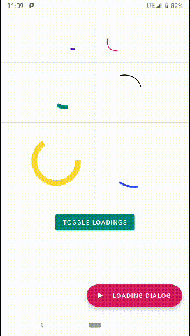
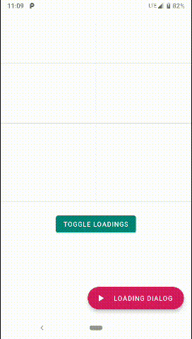

# LoadingView

Android material theme (`Theme.MaterialComponents`) loading indicator with customizable attributes

[  ](https://bintray.com/wojciechkolendo/maven/LoadingView/1.0.1/link)

## Gradle Dependency (jCenter)

```Gradle
dependencies {
    implementation 'com.wojciechkolendo:loadingview:1.0.1'
}
```

## Using ProgressBar



XML layout file:

```xml
<com.wojciechkolendo.loadingview.LoadingView
	android:layout_width="120dp"
	android:layout_height="120dp"
	android:layout_margin="24dp" />
```


Customizable attributes:

Attribute Name         |Description                                                                                                 |Default Value
-----------------------|------------------------------------------------------------------------------------------------------------|-------------
`loading_progress`         |The current progress of the progress bar.                               |0
`loading_maxProgress`  |The maximum progress of the progress bar; what's considered as 100% of the bar.                |100
`loading_animDuration`       |The duration of the indeterminate progress bar animation in milliseconds. It is the duration of all "steps" of the indeterminate animation. (Indeterminate only)   |500ms
`loading_animSwoopDuration`       |The duration of the initial swoop of the determinate animation. (Determinate only)    |5000ms
`loading_animSyncDuration`|The duration of the determinate progress update animation. When you use `setUpdate(int)`, this is how long it takes for the view to finish animating to that progress. (Determinate only)                                         |4000ms
`loading_color`     |A color of loading indicator. If colorSecondary or colorAccent are not supplied, default value is used (Material Blue 500). |#2196F3
`loading_thickness`     |The thickness of the progress bar. |4dp
`loading_indeterminate`     |Whether this progress bar is indeterminate or not. If indeterminate, the progress set on this view will not have any effect. |true
`loading_animAutostart`     |Whether this progress bar should automatically start animating once it is initialized. |true
`loading_animSteps`     |The number of "steps" in the indeterminate animation (how many times it does the loopy thing before returning to its original position). It is recommended to use an odd number, as even numbers of steps look the same after half the number of steps. |3
`loading_startAngle`     |The starting angle for progress bar. (Determinate only) |0


## Using LoadingDialog



```java
val loadingDialog = LoadingDialog(this, R.style.AppTheme_ProgressDialog)
```
#### Show
```java
loadingDialog.show()
```
#### Dismiss
```java
loadingDialog.dismiss()
```

